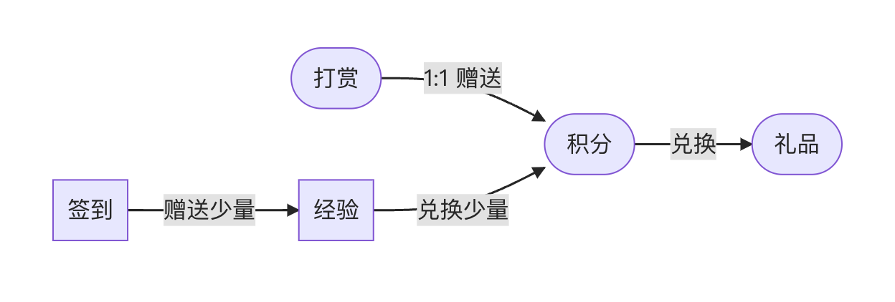

---
# 这一段可以省略，因为默认布局就是doc
layout: doc

# title定义浏览器标签页上显示的标题
title: Salary-主题介绍
---

   
主题介绍

   
—— Salary使用手册
      
          <i class="fa-regular fa-clock"></i> 最后更新： 1 天前
      
   

**主题宗旨**： 让“没有营业销售权限的个人博主”通过：“小额打赏送积分 → 积分换礼品” 的方式来与访问者进行交互。

**基本要求**： 本主题的“礼品兑换、评论可见”等功能，都基于以上思想实现。因此务必在 `网站后台/设置/用户` 启用“用户注册”来允许用户与网站的交互能力。

**交互方式**：

# 主题效果

主题效果请访问开发者本人的博客站点：[SCOTT STUDIO](https://blog.scott-studio.cn)

# 获取主题

::: warning 打赏送主题
向开发者（QQ：2406177615）打赏指定金额，作为打赏回礼，将赠送此主题给您使用

<small> 加开发者QQ时，请备注：打赏送主题</small>
:::

<mark>赠品须知</mark>

 - 赠送回礼时，开发者将与您约定一个您拥有的域名，此主题只能安装在此域名下。域名不可变更
 - 赠品不得分享到任何地方，只允许打赏者本人使用
 - 赠品是打赏时的最新版，若未来有版本更新，也将提供给您
