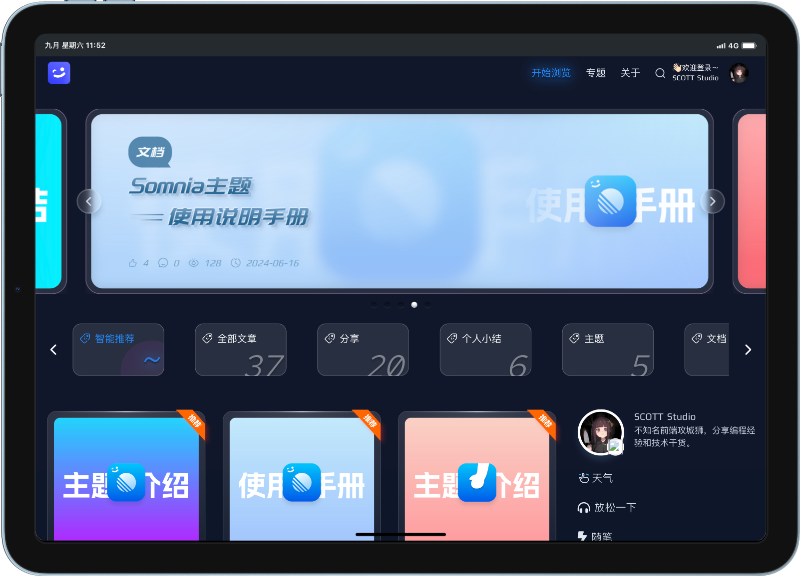
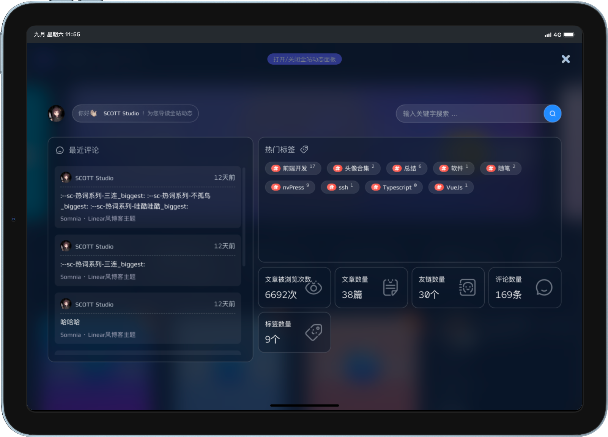

---
# 这一段可以省略，因为默认布局就是doc
layout: doc

# title定义浏览器标签页上显示的标题
title: Somnia-导航栏
---

   
导航栏

   
—— Somnia使用手册
      
        <i class="fa-regular fa-clock"></i> 最后更新： 2024-09-07 11:19:44
      
   

在更新升级到最新版本的Somnia后，导航栏的样式发生了变化。
我们提供了两种导航栏样式供您选择，您可以根据自己的喜好来选择。

## 默认导航栏  

默认导航栏是Somnia的默认样式，它提供了常用的功能按钮，如搜索、菜单、登录、注册等。

## 2.0版本沉浸式导航栏

Somnia 2.0版本引入了沉浸式导航栏，它提供了更加简洁的导航栏样式，并提供了更多的功能按钮。

### 如何启用沉浸式导航栏

沉浸式导航栏是Somnia 2.0版本新增的功能，您需要在 `后台-外观-主题设置` 中找到 <mark>是否开启沉浸式导航栏</mark> 并启用它。
